# Troubleshooting Incidents | osTicket Helpdesk on Windows Server 2022

A self-hosted IT helpdesk ticketing system deployed on Windows Server 2022, used to simulate real-world end-user support tickets from submission through resolution. It demonstrates the full support workflow: triage, diagnostic reasoning, and resolution documentation, the same process used in real IT support and helpdesk roles.

Focus areas: Ticketing system deployment, IIS/PHP/MySQL configuration, help desk triage workflow, troubleshooting documentation

## Environment

| Component | Details |
|---|---|
| OS | Windows Server 2022 |
| Web Server | IIS with FastCGI |
| Scripting | PHP (via FastCGI) |
| Database | MySQL 8.0 |
| Application | osTicket |

**Note on stack choice:** osTicket is most commonly deployed on a Linux/LAMP stack. This project was intentionally deployed on Windows Server with IIS instead, to stay consistent with the existing Windows Server environment used across this portfolio and to gain hands-on experience configuring PHP applications under IIS rather than defaulting to the more common setup.

## Deployment Summary

osTicket was deployed from scratch on a standalone Windows Server 2022 instance. Setup involved installing and configuring IIS with the CGI role service, installing PHP and connecting it to IIS via a FastCGI handler mapping, installing MySQL and provisioning a dedicated database and user, and finally installing and configuring osTicket itself, including Help Topics, department setup, and folder/file permissions for IIS_IUSRS.

Along the way, several real configuration issues came up and were diagnosed and resolved directly, including a FastCGI module registration error caused by a missing CGI role service, an HTTP 500 error traced to a missing PHP extension, and a broken PHP session configuration that was blocking staff and client logins entirely until the session save path and folder permissions were corrected.

### Setup Screenshots

**IIS Web Server role installed**

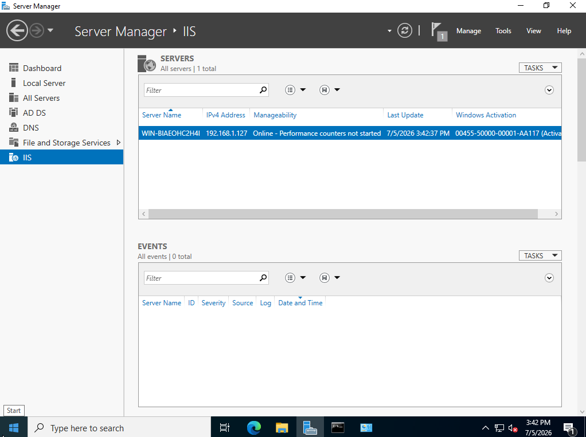

**Default IIS welcome page confirming the web server is running**

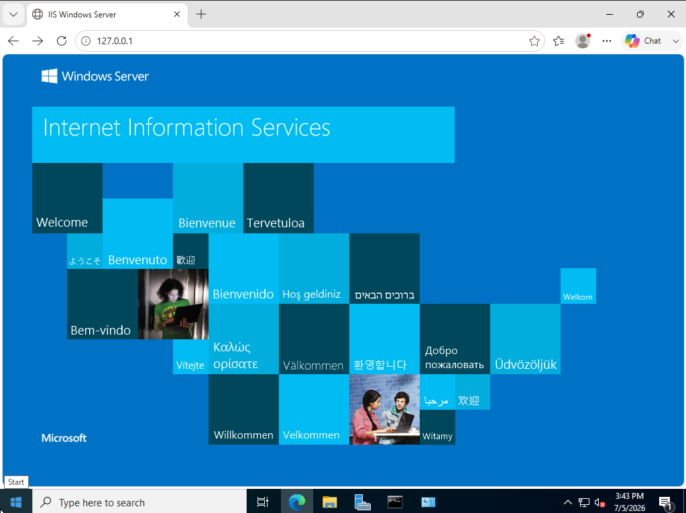

**FastCGI handler mapping connecting IIS to PHP**

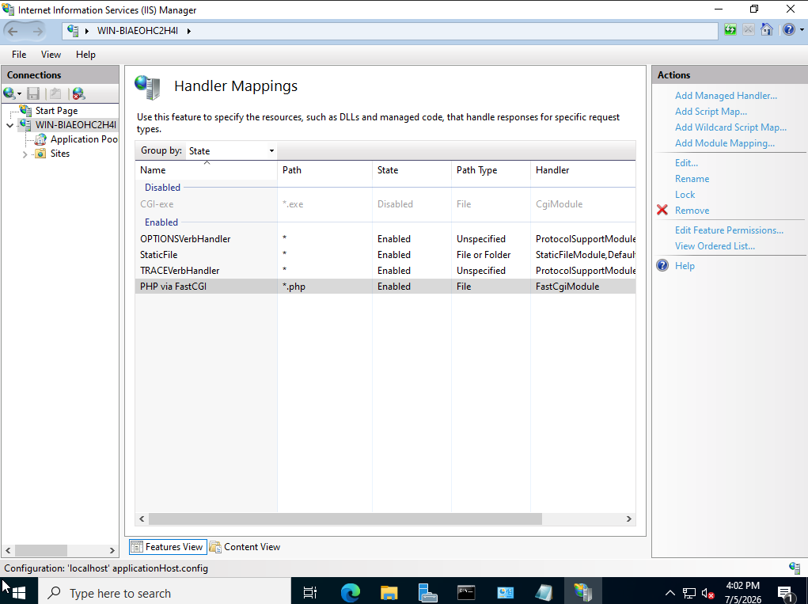

**phpinfo() page confirming PHP is installed and running under IIS**

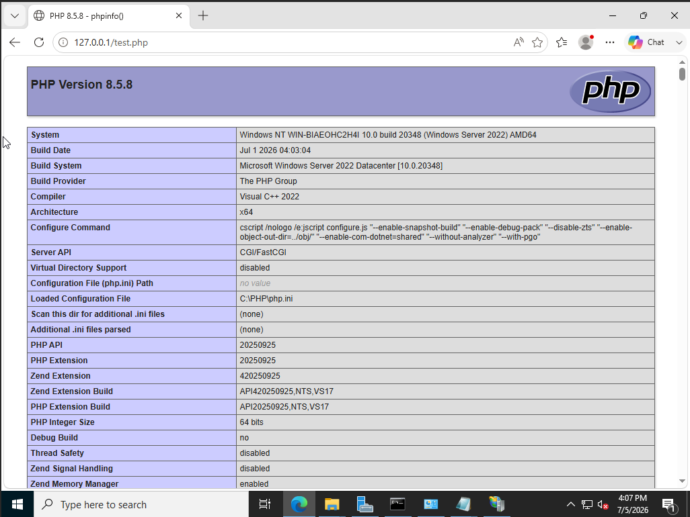

**MySQL80 service confirmed running**

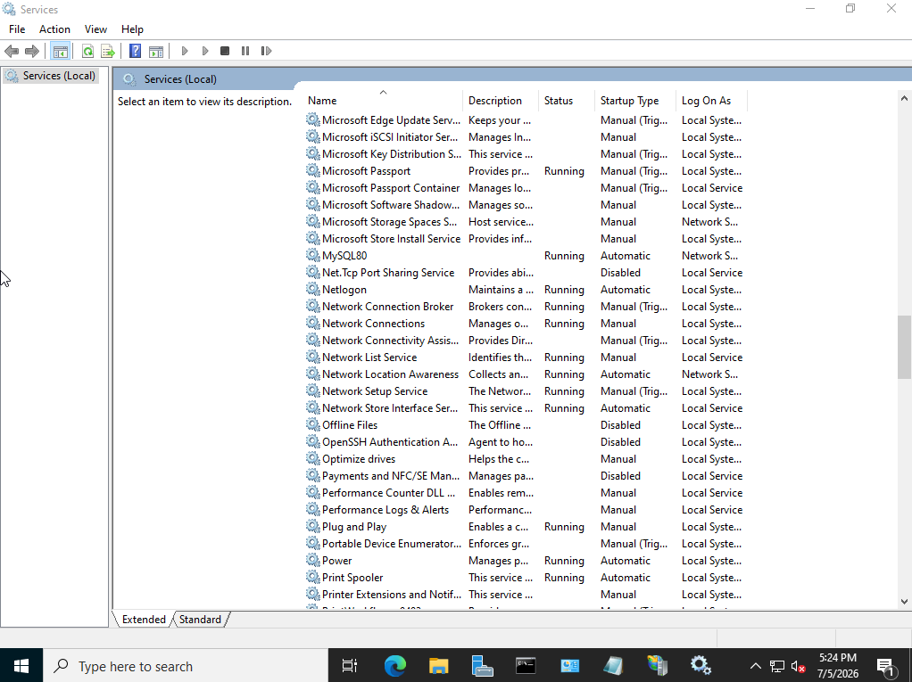

**MySQL command line output confirming the osTicket database, dedicated user, and privileges were created**

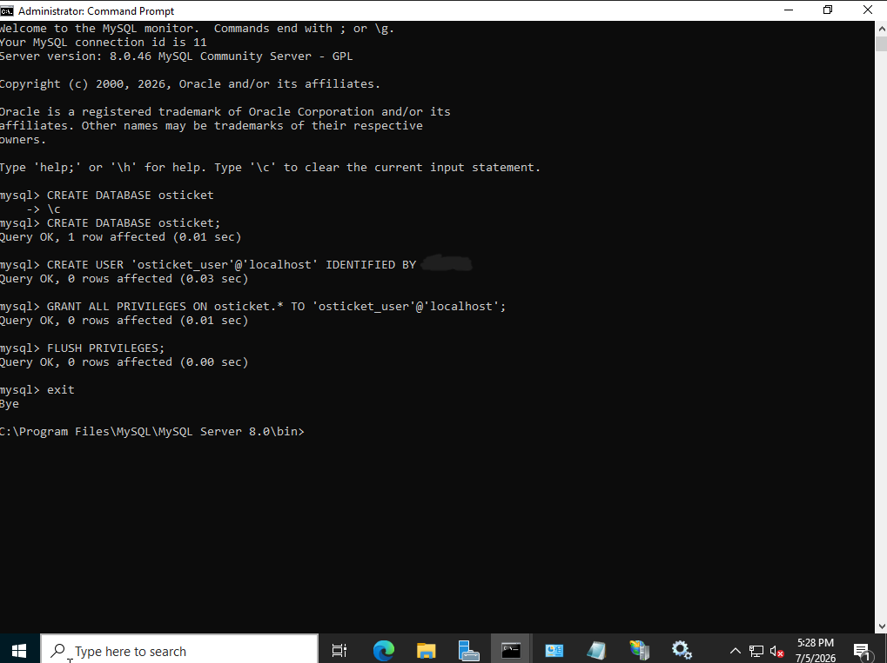

**IIS_IUSRS granted Modify permission on the osTicket application folder**

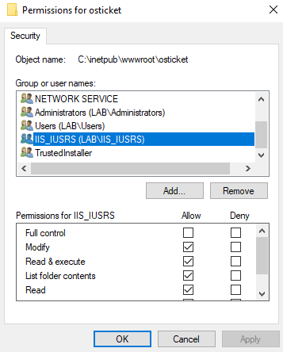

**osTicket installation wizard completion screen**

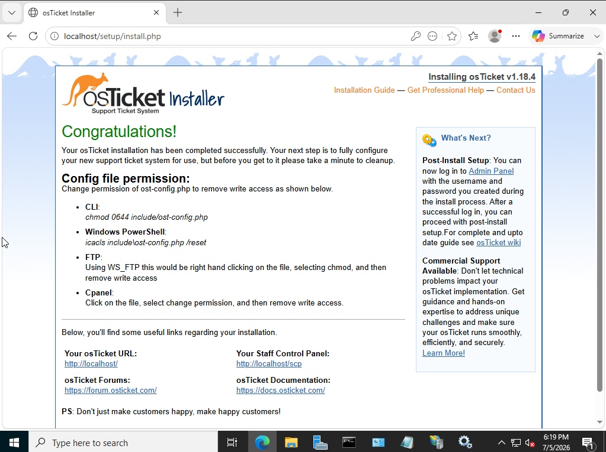

**Staff Control Panel dashboard after first login**

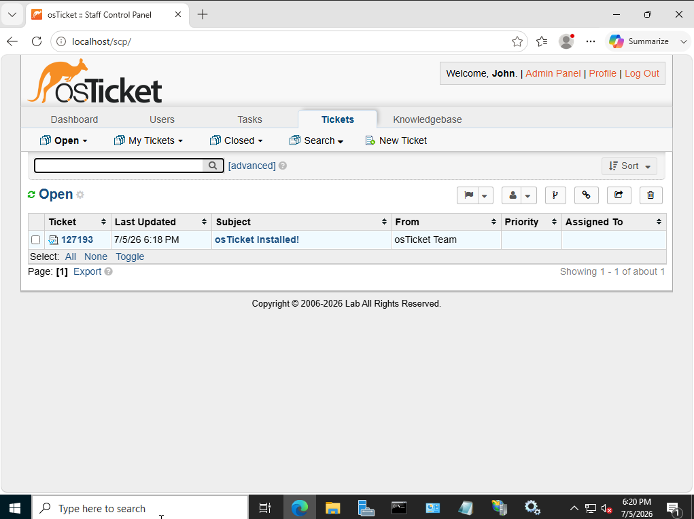

**Configured Help Topics used to categorize incoming tickets**

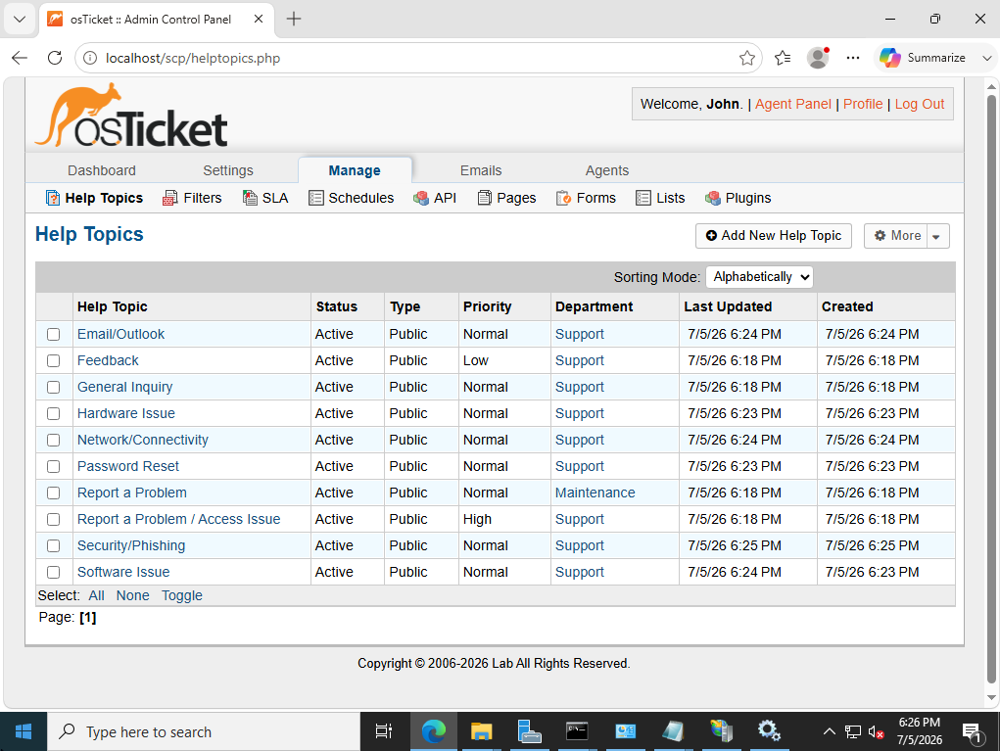

## Help Topics

Tickets are categorized using the following Help Topics, configured to route to the IT Support department:

- Password Reset
- Hardware Issue
- Software Issue
- Network/Connectivity
- Email/Outlook
- Security/Phishing

## Ticket Walkthroughs

Each ticket below was worked through the full support lifecycle: initial complaint, agent triage/clarifying questions, internal diagnostic notes, and resolution, mirroring how a real support ticket would be handled and documented.

### Ticket 1: Printer Not Working (Hardware Issue)

**User report:** User reported their networked office printer was not responding to print jobs, with no error message displayed.

**Triage:** Asked the user whether the printer was networked or USB-connected, whether any lights were blinking on the device, and whether it showed as "Offline" in Windows.

**Diagnosis:** User confirmed the printer showed as "Ready" rather than "Offline," which ruled out a connectivity or driver issue and pointed toward a stuck print job or spooler issue instead.

**Resolution:** Identified and cleared a stuck job in the print queue, then restarted the Print Spooler service as a precaution. User confirmed a test print completed successfully.

**Screenshot:**

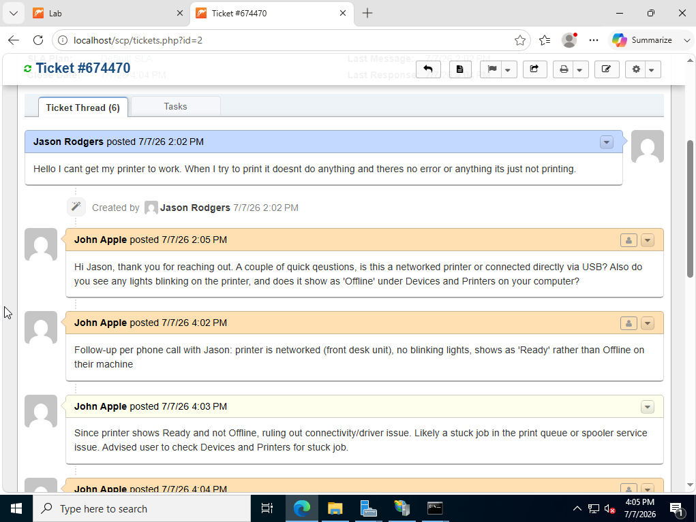
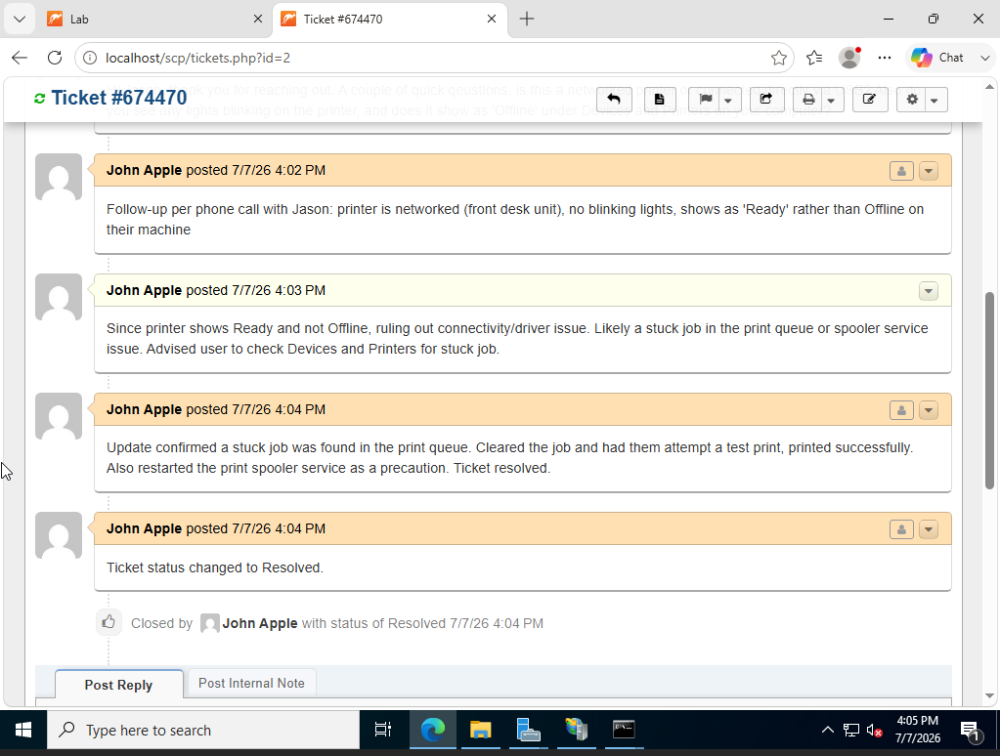

---

### Ticket 2: VPN Connection Failure (Network/Connectivity)

**User report:** User was unable to connect to the VPN from home, receiving a "Connection Failed, Error 809" message. The connection had worked the previous week.

**Triage:** Asked whether a specific error code was shown, and whether the user was on a work or personal device connected via Wi-Fi or wired connection.

**Diagnosis:** Error 809 typically indicates that a required VPN port (UDP 500/4500) is being blocked, commonly by a home router or ISP rather than a server-side issue. Confirmed no changes had been made on the VPN server side.

**Resolution:** Switched the user's VPN client profile from IKEv2 to SSTP, which uses TCP port 443, a port far less likely to be blocked by home network equipment. User confirmed the connection succeeded afterward.

**Screenshot:**

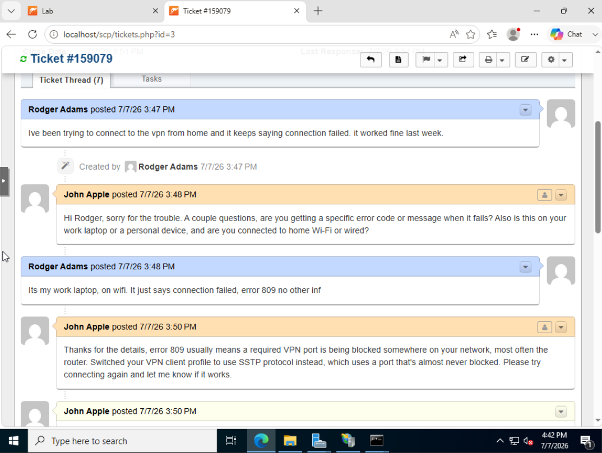
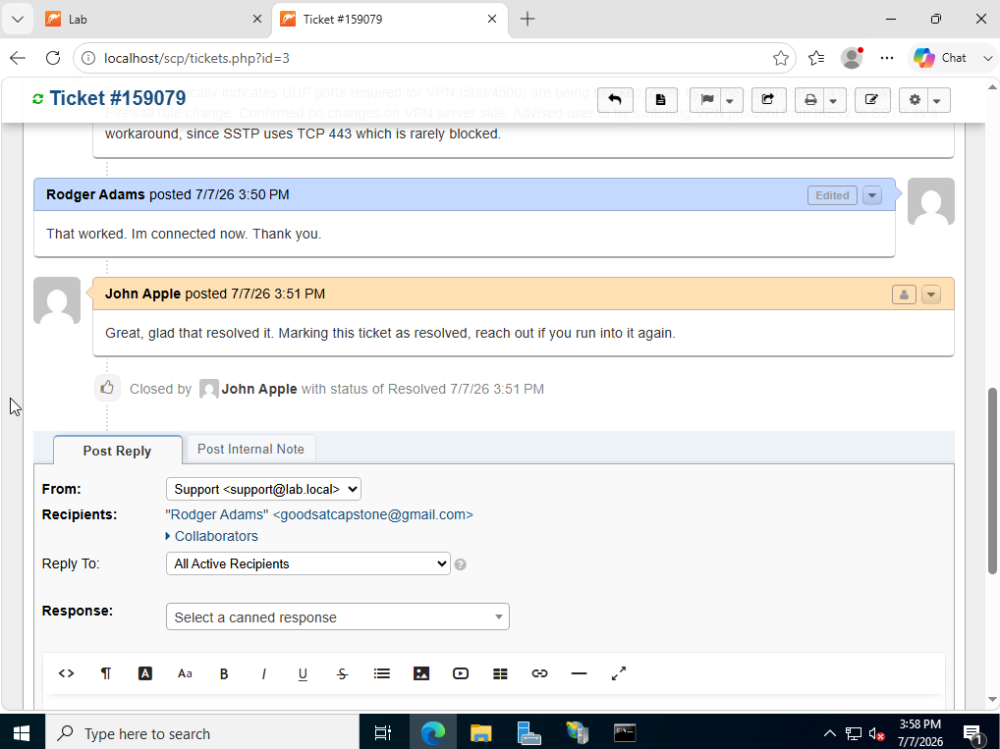

## Skills Demonstrated

- Deployment of a web-based application (osTicket) on Windows Server using IIS, PHP, and MySQL
- Diagnosing and resolving real IIS/PHP configuration issues (FastCGI registration, missing extensions, session handling)
- Ticket triage and structured troubleshooting methodology
- Root cause analysis based on technical symptoms (e.g., printer status codes, VPN error codes)
- Clear, professional resolution documentation suitable for a real support environment
- Help desk software configuration (Help Topics, Departments, folder/file permissions)

## What I Would Expand Next

- Additional ticket categories (software installation failures, phishing/security reports, account lockouts)
- SMTP email integration for real ticket notifications (attempted; blocked by a missing PHP OpenSSL extension, root cause identified, to be revisited)
- Integration with the Active Directory Lab environment for a combined identity + support ticketing simulation
- SLA policies and ticket escalation rules
